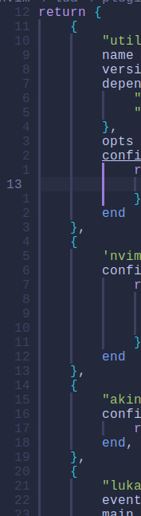

# 先决条件

- nix
- tree-sitter-cli
- unzip


> 查看文件类型

```shell
:set filetype
```

`RRethy/vim-illuminate` : 相同单词高亮

`lukas-reineke/indent-blankline.nvim` : 缩进空白行



`akinsho/bufferline.nvim` : 


`lewis6991/gitsigns.nvim` : 缓冲区的 Git 集成


# 安装要求

wget

unzip

python

fzf

# 模糊搜索

```shell
sudo pacman -S ripgrep
```

# 插件列表

> nvim-treesitter

使用`main` 分支，`window` 中需要指定 `CC` 环境变量。要不然 `tree-sitter CLI` 会使用 `cl.exe` 进行编译
